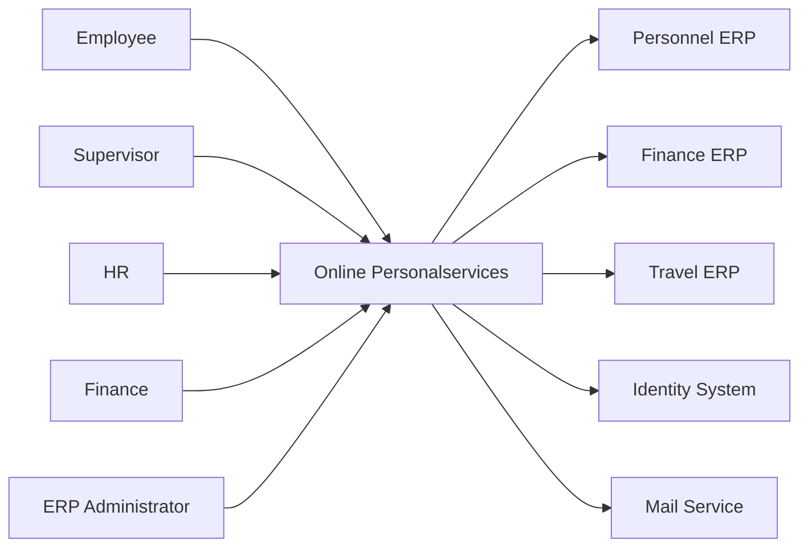
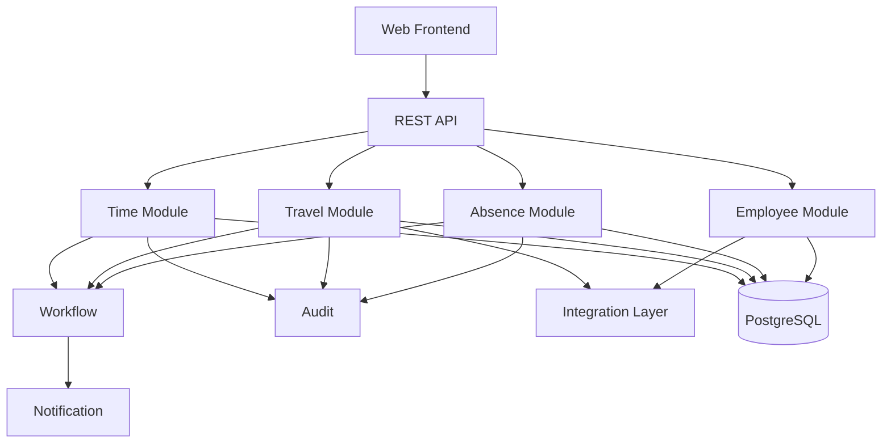

# AGENT.md — University Online Personalservices Prototype

## 0. Purpose of This File

This file is the authoritative implementation specification for a coding agent that must design and build a working prototype of a **University Online Personalservices** platform.

The prototype represents a modern employee self-service solution for a university administration. It must integrate with a legacy or existing university ERP landscape while providing a unified web experience for employees, supervisors, HR staff, travel-office staff, finance approvers, time administrators, and system administrators.

The prototype is intended to demonstrate:

- enterprise application architecture
- ERP integration
- relational data modelling
- workflow and approval design
- batch processing
- role-based access control
- auditability
- observability
- clean modular software engineering
- realistic university administration processes
- safe integration with existing systems of record

The system must be demo-ready.

The agent should make reasonable implementation decisions independently and avoid unnecessary clarification questions. When several valid technical options exist, prefer the simplest option that preserves clean architecture and demonstrates production-oriented engineering.

---

# 1. Product Mission

Build one unified web platform named:

**Online Personalservices**

with three primary business modules:

1. **Abwesenheitsverwaltung**
   - leave and absence management

2. **Dienstreisemanagement**
   - business travel requests, approvals, travel expenses, and settlement

3. **Zeiterfassung**
   - working-time recording, daily balances, corrections, and approvals

These modules must not be implemented as isolated applications.

They must share:

- identity
- authentication
- authorization
- employee master data
- organisational structure
- approval logic
- workflow infrastructure
- delegation
- notifications
- audit logging
- document metadata
- integration interfaces
- batch processing
- monitoring
- error handling
- reporting
- configuration

High-level vision:

```text
                         UNIVERSITY EMPLOYEES
                                  │
                                  ▼
                  ┌────────────────────────────┐
                  │   ONLINE PERSONALSERVICES  │
                  └──────────────┬─────────────┘
                                 │
             ┌───────────────────┼───────────────────┐
             │                   │                   │
             ▼                   ▼                   ▼
       Abwesenheit          Dienstreise         Zeiterfassung
             │                   │                   │
             └───────────────────┼───────────────────┘
                                 │
                                 ▼
                     Shared Platform Services
                                 │
                                 ▼
                        Integration Layer
                                 │
               ┌─────────────────┼──────────────────┐
               │                 │                  │
               ▼                 ▼                  ▼
        Personnel ERP       Finance ERP        Identity/SSO
               │                 │                  │
               ├────────────► Travel ERP            │
               ├────────────► Time System            │
               └────────────► Mail / DMS / Reporting │
```

---

# 2. University Context

Assume a medium-to-large public university with:

- central university administration
- faculties
- institutes
- departments
- administrative units
- academic and non-academic employees
- full-time and part-time employment
- supervisors
- delegated approvers
- HR administration
- travel office
- finance / accounting
- cost centres
- externally funded projects
- working-time rules
- public-sector governance requirements
- data-protection requirements
- existing legacy ERP systems
- separate identity-management infrastructure

The university already has systems of record for personnel, finance, and identity.

Online Personalservices must not replace all existing ERP systems.

It should act as:

- employee self-service portal
- workflow platform
- orchestration layer
- integration layer
- transaction system for online requests
- user-friendly façade over selected university administration processes

---

# 3. Core Architectural Principle

Use a **modular monolith** with **hexagonal architecture / ports and adapters**.

Do not start with microservices.

Reasons:

- the business modules share many concepts;
- deployment should be easy for a prototype;
- transaction volume is moderate;
- a small university IT team should be able to operate it;
- the architecture should remain easy to understand;
- modules can later be extracted if needed.

Architecture:

```text
Web Frontend
     │
     ▼
REST API
     │
     ▼
Application Services
     │
 ┌───┼───────────────────────────────────────┐
 │   │                                       │
 ▼   ▼                                       ▼
Employee  Absence  Travel  Time       Shared Platform
                                       │
                                       ├─ Workflow
                                       ├─ Security
                                       ├─ Audit
                                       ├─ Notification
                                       ├─ Batch
                                       ├─ Documents
                                       └─ Reporting
                                             │
                                             ▼
                                      Integration Ports
                                             │
                                             ▼
                                      External Adapters
                                             │
                  ┌──────────────────────────┼─────────────────────┐
                  ▼                          ▼                     ▼
           Personnel ERP               Finance ERP          Identity System
                  │                          │                     │
                  ├──────────────► Travel ERP                     │
                  ├──────────────► Time System                    │
                  └──────────────► Mail / DMS / Reporting         │
```

---

# 4. Technology Stack

Use the following unless a compelling technical reason exists to deviate.

## 4.1 Backend

- Java 21
- Spring Boot 3.x
- Maven
- Spring Web
- Spring Data JPA
- Spring Security
- Spring Validation
- Spring Scheduler
- Spring Actuator
- PostgreSQL
- Flyway
- OpenAPI / Swagger
- Micrometer
- JUnit 5
- Mockito
- Testcontainers

Recommended:

- MapStruct
- Resilience4j

Avoid unnecessary frameworks.

---

## 4.2 Frontend

Preferred:

- Angular 18+
- TypeScript
- Angular Router
- Angular Reactive Forms
- Angular Material
- RxJS

Alternative:

- React + TypeScript

If an alternative is used, document the reason in `docs/architecture.md`.

---

## 4.3 Infrastructure

Use:

- Docker
- Docker Compose
- PostgreSQL
- MailHog
- optional Prometheus
- optional Grafana

The whole prototype must start with:

```bash
docker compose up --build
```

---

# 5. Repository Structure

Use a mono-repository:

```text
online-personalservices/
│
├── AGENT.md
├── README.md
├── docker-compose.yml
├── .env.example
│
├── docs/
│   ├── architecture.md
│   ├── data-model.md
│   ├── api.md
│   ├── workflows.md
│   ├── security.md
│   ├── integrations.md
│   ├── batch-processing.md
│   ├── test-strategy.md
│   └── demo-script.md
│
├── backend/
│   ├── pom.xml
│   └── src/
│       ├── main/
│       │   ├── java/edu/university/ops/
│       │   │   ├── OnlinePersonalservicesApplication.java
│       │   │   │
│       │   │   ├── employee/
│       │   │   │   ├── domain/
│       │   │   │   ├── application/
│       │   │   │   ├── api/
│       │   │   │   ├── persistence/
│       │   │   │   └── integration/
│       │   │   │
│       │   │   ├── organisation/
│       │   │   │   ├── domain/
│       │   │   │   ├── application/
│       │   │   │   ├── api/
│       │   │   │   └── persistence/
│       │   │   │
│       │   │   ├── absence/
│       │   │   │   ├── domain/
│       │   │   │   ├── application/
│       │   │   │   ├── api/
│       │   │   │   └── persistence/
│       │   │   │
│       │   │   ├── travel/
│       │   │   │   ├── domain/
│       │   │   │   ├── application/
│       │   │   │   ├── api/
│       │   │   │   └── persistence/
│       │   │   │
│       │   │   ├── time/
│       │   │   │   ├── domain/
│       │   │   │   ├── application/
│       │   │   │   ├── api/
│       │   │   │   └── persistence/
│       │   │   │
│       │   │   └── shared/
│       │   │       ├── security/
│       │   │       ├── workflow/
│       │   │       ├── audit/
│       │   │       ├── notification/
│       │   │       ├── documents/
│       │   │       ├── integration/
│       │   │       ├── batch/
│       │   │       ├── reporting/
│       │   │       ├── monitoring/
│       │   │       ├── configuration/
│       │   │       └── exception/
│       │   │
│       │   └── resources/
│       │       ├── application.yml
│       │       ├── db/migration/
│       │       └── seed/
│       │
│       └── test/
│
└── frontend/
    ├── package.json
    └── src/
        ├── app/
        │   ├── core/
        │   ├── shared/
        │   ├── dashboard/
        │   ├── profile/
        │   ├── absence/
        │   ├── travel/
        │   ├── time/
        │   ├── tasks/
        │   └── admin/
        └── environments/
```

---

# 6. Functional Modules

## 6.1 Employee Module

Purpose:

Provide a stable internal employee representation without turning Online Personalservices into the master HR system.

The external personnel ERP remains the system of record.

### Employee fields

```text
Employee
- id
- externalEmployeeId
- personnelNumber
- firstName
- lastName
- email
- username
- organisationUnitId
- primaryEmploymentId
- active
- syncedAt
```

### Requirements

The module must:

- expose current employee information;
- resolve employee by logged-in identity;
- link employees to organisational units;
- expose supervisor relationships;
- expose current employment;
- expose work schedule;
- expose roles;
- support synchronized external master data;
- mark employees inactive instead of deleting them.

---

# 7. Organisation Model

Create a hierarchical organisational model.

Example:

```text
University
├── Central Administration
│   ├── Human Resources
│   ├── Finance
│   └── IT
│
├── Faculty A
│   ├── Institute A1
│   └── Institute A2
│
└── Faculty B
    ├── Department B1
    └── Department B2
```

Entity:

```text
OrganisationUnit
- id
- externalId
- code
- name
- type
- parentId
- costCentre
- active
```

Types:

- UNIVERSITY
- CENTRAL_ADMINISTRATION
- FACULTY
- INSTITUTE
- DEPARTMENT
- UNIT
- PROJECT_UNIT

---

# 8. Employment Model

Do not assume one person always has only one employment relationship.

```text
Employment
- id
- employeeId
- externalEmploymentId
- startDate
- endDate
- employmentType
- weeklyHours
- fullTimeEquivalent
- workScheduleId
- status
```

Statuses:

- ACTIVE
- FUTURE
- ENDED
- SUSPENDED

Employment types can include:

- ACADEMIC
- ADMINISTRATIVE
- TECHNICAL
- STUDENT_ASSISTANT
- OTHER

No payroll implementation is required.

---

# 9. Supervisor and Approval Relationships

Do not store only a single `supervisor_id` field on employee.

Create:

```text
ApprovalRelation
- id
- employeeId
- approverId
- approvalType
- priority
- validFrom
- validTo
```

Approval types:

- ABSENCE
- TRAVEL
- TIME_CORRECTION
- FINANCIAL
- HR_REVIEW

This supports different approval chains.

---

# 10. Roles

Implement role-based access control.

Roles:

```text
EMPLOYEE
SUPERVISOR
HR_ADMIN
TRAVEL_OFFICE
FINANCIAL_APPROVER
TIME_ADMIN
ERP_ADMIN
SUPPORT
AUDITOR
```

There is deliberately no `DELEGATE` role: delegation is a time-bounded relation (§18), and a role would duplicate and drift from it (see ADR-011 in `docs/architecture.md`).

Use:

```text
Role
- id
- name

UserRole
- employeeId
- roleId
- validFrom
- validTo
```

Authorization must also consider organisational scope.

Example:

A supervisor may only view requests from employees for whom the supervisor is an active approver.

---

# 11. Authentication

For the prototype:

- provide local demo authentication;
- simulate university SSO;
- keep authentication behind an interface.

Create:

```java
public interface IdentityProvider {
    AuthenticatedUser authenticate(...);
    Optional<ExternalIdentity> findIdentity(String username);
}
```

This is the single identity port. The `IdentityGateway` listed in §22 is merged into it.

Provide:

```text
MockIdentityProvider
```

Optional future adapter:

```text
LdapIdentityProvider
```

Do not hard-code authentication directly into business modules.

---

# 12. Dashboard

After login, show:

- greeting
- employee name
- organisational unit
- current leave balance
- current working-time balance
- open tasks
- pending requests
- upcoming approved absences
- recent travel requests
- latest notifications

Different roles should see different dashboards.

Supervisor dashboard:

- requests awaiting approval
- team absences
- time-correction tasks

HR dashboard:

- system exceptions
- pending HR cases
- integration health

Administrator dashboard:

- batch jobs
- integration errors
- system health
- recent audit activity

---

# 13. Absence Management

## 13.1 Leave Types

Create configurable leave types:

```text
ANNUAL_LEAVE
FLEX_DAY
SICK_LEAVE
SPECIAL_LEAVE
UNPAID_LEAVE
OTHER
```

Entity:

```text
LeaveType
- id
- code
- name
- deductsEntitlement
- requiresApproval
- creditsWorkingTime
- attachmentRequired
- active
```

---

## 13.2 Work Schedule

```text
WorkSchedule
- id
- employeeId
- validFrom
- validTo
- weeklyTargetMinutes
```

```text
WorkScheduleDay
- id
- workScheduleId
- weekday
- targetMinutes
- workingDay
```

Example part-time schedule:

```text
Monday       480
Tuesday      480
Wednesday    480
Thursday     480
Friday         0
```

---

## 13.3 Holiday Calendar

```text
Holiday
- id
- date
- name
- regionCode
```

Seed a small generic public-holiday calendar.

---

## 13.4 Leave Entitlement

```text
LeaveEntitlement
- id
- employeeId
- year
- leaveTypeId
- baseDays
- carryOverDays
- additionalDays
- usedDays
- reservedDays
- remainingDays
- expiryDate
```

Provide deterministic calculation logic.

---

## 13.5 Absence Request

```text
AbsenceRequest
- id
- employeeId
- leaveTypeId
- startDate
- endDate
- representativeEmployeeId
- comment
- status
- workflowInstanceId
- createdAt
- submittedAt
- updatedAt
```

Statuses:

```text
DRAFT
SUBMITTED
IN_APPROVAL
APPROVED
REJECTED
CANCEL_REQUESTED
CANCELLED
```

---

## 13.6 Absence Day

Create individual calculated absence days:

```text
AbsenceDay
- id
- absenceRequestId
- date
- plannedMinutes
- creditedMinutes
- entitlementDeduction
```

Reason:

A request from Monday to Friday may include:

- working days
- non-working days
- public holidays
- part-time days

Only eligible days should reduce entitlement.

---

## 13.7 Absence Validation Rules

Validate:

- end date is not before start date;
- leave type is active;
- employee is active;
- employment covers requested period;
- no overlapping approved/pending absence exists;
- sufficient leave balance exists when required;
- representative is not the employee;
- request is not entirely non-working days;
- required attachments exist where configured.

---

## 13.8 Absence Workflow

```text
DRAFT
  │
  ▼
SUBMITTED
  │
  ▼
VALIDATION
  │
  ├── invalid ───────► RETURN ERROR
  │
  ▼
SUPERVISOR APPROVAL
  │
  ├── reject ────────► REJECTED
  │
  ▼
APPROVED
  │
  ▼
UPDATE ENTITLEMENT
  │
  ▼
NOTIFICATION
```

Support cancellation.

---

# 14. Travel Management

## 14.1 Travel Request

```text
TravelRequest
- id
- employeeId
- purpose
- destinationCity
- destinationCountry
- startDateTime
- endDateTime
- transportMode
- estimatedCost
- currency
- costCentre
- projectCode
- comment
- status
- workflowInstanceId
- createdAt
- submittedAt
```

Transport modes:

- TRAIN
- PUBLIC_TRANSPORT
- CAR
- FLIGHT
- BICYCLE
- OTHER

---

## 14.2 Travel Workflow

Implement:

```text
DRAFT
  │
  ▼
SUBMITTED
  │
  ▼
SUPERVISOR APPROVAL
  │
  ├── REJECTED
  │
  ▼
FINANCIAL APPROVAL
  │
  ├── REJECTED
  │
  ▼
AUTHORIZED
  │
  ▼
TRAVEL COMPLETED
  │
  ▼
EXPENSE CLAIM
  │
  ▼
TRAVEL OFFICE REVIEW
  │
  ▼
SETTLED
```

Allow a travel request to be returned for correction.

---

## 14.3 Funding

```text
FundingSource
- id
- costCentre
- projectCode
- fundCode
- description
- active
```

```text
TravelFunding
- id
- travelRequestId
- fundingSourceId
- percentage
- amount
```

Support split funding.

Validation:

- funding percentages total 100 when percentages are used;
- amount cannot exceed expected total when configured.

---

## 14.4 Travel Expenses

```text
TravelExpense
- id
- travelRequestId
- expenseType
- expenseDate
- amount
- currency
- description
- receiptDocumentId
- status
```

Expense types:

- TRAIN
- FLIGHT
- HOTEL
- TAXI
- LOCAL_TRANSPORT
- MILEAGE
- MEALS
- CONFERENCE_FEE
- OTHER

No complex statutory reimbursement engine is required.

---

## 14.5 Documents

Store document metadata only.

```text
Document
- id
- businessObjectType
- businessObjectId
- documentType
- fileName
- contentType
- storageReference
- uploadedBy
- uploadedAt
```

For local demo:

Store files in a mounted local directory or simple object-storage-compatible folder abstraction.

Never store large files directly in normal transaction tables.

---

# 15. Time Recording

## 15.1 Time Entry

```text
TimeEntry
- id
- employeeId
- timestamp
- type
- source
- createdAt
```

Types:

```text
CLOCK_IN
CLOCK_OUT
BREAK_START
BREAK_END
```

Sources:

- WEB
- ADMIN
- IMPORT
- MOCK_TERMINAL

---

## 15.2 Daily Time Account

```text
TimeAccountDay
- id
- employeeId
- date
- targetMinutes
- workedMinutes
- breakMinutes
- absenceMinutes
- creditedMinutes
- balanceMinutes
- status
```

Statuses:

- OPEN
- CALCULATED
- CORRECTION_PENDING
- CLOSED

---

## 15.3 Calculation

Conceptual formula:

```text
creditedMinutes =
    workedMinutes
    + eligibleAbsenceMinutes

balanceMinutes =
    creditedMinutes
    - targetMinutes
```

Ensure breaks are handled correctly.

An approved absence must affect time calculation.

---

## 15.4 Cross-Module Integration

When absence is approved:

```text
AbsenceApproved
       │
       ▼
Time Module
       │
       ▼
Credit eligible absence minutes
```

When cancelled:

```text
AbsenceCancelled
       │
       ▼
Time Module
       │
       ▼
Recalculate day
```

Implement this through internal domain events or a simple application event mechanism.

Do not create direct table coupling between modules.

---

## 15.5 Time Correction

```text
TimeCorrectionRequest
- id
- employeeId
- date
- operation            (ADD | MODIFY | DELETE)
- originalTimeEntryId  (null for ADD, e.g. a missing clock-out)
- requestedTimestamp
- requestedType
- reason
- status
- workflowInstanceId
```

Workflow:

```text
EMPLOYEE
   │
   ▼
REQUEST CORRECTION
   │
   ▼
SUPERVISOR / TIME ADMIN
   │
   ├── REJECT
   │
   ▼
APPROVE
   │
   ▼
APPLY CORRECTION
   │
   ▼
RECALCULATE DAY
```

---

# 16. Shared Workflow Engine

Do not hard-code every approval step directly into controllers.

Create generic workflow concepts.

```text
WorkflowDefinition
- id
- code
- version
- active
```

```text
WorkflowInstance
- id
- workflowDefinitionId
- businessObjectType
- businessObjectId
- currentStep
- status
- createdAt
- completedAt
```

```text
WorkflowStep
- id
- workflowInstanceId
- stepNumber
- stepType
- assignedEmployeeId
- assignedRole
- status
- startedAt
- completedAt
```

```text
ApprovalDecision
- id
- workflowStepId
- approverId
- onBehalfOfId   (set when the approver acts as a delegate)
- decision
- comment
- decidedAt
```

Ownership of state (ADR-004): the business module owns the request status (`AbsenceRequest.status` etc.); the workflow owns only step and task state. Both change in the same transaction. The workflow never calls into business modules. It publishes `WorkflowStepCompleted` / `WorkflowCompleted` events that the owning module handles.

`UserTask` is the inbox projection of an open `WorkflowStep`. Assignment lives on the step.

Decisions:

- APPROVE
- REJECT
- RETURN_FOR_CORRECTION
- FORWARD

The prototype does not need a full BPMN engine.

A simple configurable workflow service is sufficient.

---

# 17. Task Inbox

Create a generic task list.

Examples:

```text
Approve annual leave request
Approve business travel
Perform financial approval
Review travel expense claim
Approve time correction
```

Entity:

```text
UserTask
- id
- workflowStepId
- assignedToEmployeeId
- assignedRole
- title
- description
- dueDate
- status
```

Statuses:

- OPEN
- COMPLETED
- CANCELLED

---

# 18. Delegation

Create:

```text
Delegation
- id
- delegatorId
- delegateId
- approvalType
- validFrom
- validTo
- active
```

Example:

A supervisor is away for two weeks and delegates absence approvals to another manager.

The workflow resolver must consider active delegation. Delegation is resolved when tasks are queried, not when they are assigned: a task stays assigned to the original approver and is visible to any active delegate. The decision records `onBehalfOfId`.

---

# 19. Notifications

Centralize notifications.

```text
Notification
- id
- recipientEmployeeId
- type
- businessObjectType
- businessObjectId
- subject
- message
- status
- createdAt
- sentAt
```

Types:

```text
ABSENCE_SUBMITTED
ABSENCE_APPROVAL_REQUIRED
ABSENCE_APPROVED
ABSENCE_REJECTED

TRAVEL_SUBMITTED
TRAVEL_APPROVAL_REQUIRED
TRAVEL_AUTHORIZED
TRAVEL_REJECTED
TRAVEL_EXPENSE_REVIEW_REQUIRED
TRAVEL_SETTLED

TIME_CORRECTION_REQUIRED
TIME_CORRECTION_APPROVED
TIME_CORRECTION_REJECTED

BATCH_FAILURE
INTEGRATION_FAILURE
```

Deliver through:

```java
public interface NotificationGateway {
    void send(NotificationMessage message);
}
```

Provide:

- `MailNotificationAdapter`
- `InAppNotificationAdapter`

Mail goes to MailHog in the prototype.

---

# 20. Audit Logging

Every sensitive business operation must generate an audit record.

```text
AuditLog
- id
- actorEmployeeId
- action
- entityType
- entityId
- oldValueJson
- newValueJson
- timestamp
- correlationId
```

Audit:

- request submission
- approval
- rejection
- forwarding
- cancellation
- role changes
- manual data correction
- time correction
- administrative override
- integration import
- batch changes

Audit records must not be editable through normal application APIs.

---

# 21. Integration Layer

The integration layer isolates business logic from external university systems.

Use this pattern:

```text
Business Service
      │
      ▼
Port / Gateway Interface
      │
      ▼
Adapter
      │
      ▼
Technical Client
      │
      ▼
External System
```

Example:

```text
EmployeeService
      │
      ▼
EmployeeMasterDataGateway
      │
      ▼
PersonnelErpAdapter
      │
      ▼
Mock Personnel ERP
```

---

# 22. Integration Ports

Define interfaces such as:

```java
public interface EmployeeMasterDataGateway {
    Optional<ExternalEmployee> findEmployee(String personnelNumber);
    List<ExternalEmployee> findChangedEmployees(Instant since);
}
```

```java
public interface OrganisationGateway {
    List<ExternalOrganisationUnit> findChangedOrganisationUnits(Instant since);
}
```

```java
public interface TravelErpGateway {
    ExternalTravelReference exportApprovedTravel(ApprovedTravel travel);
    ExternalSettlementReference exportSettlement(TravelSettlement settlement);
}
```

```java
public interface FinanceGateway {
    boolean validateCostCentre(String costCentre);
    FinancePostingResult postTravelSettlement(FinancePosting posting);
}
```

Identity lookups go through the `IdentityProvider` port (§11). Mail delivery goes through `NotificationGateway` (§19) and its `MailNotificationAdapter`. There are no separate `IdentityGateway` or `MailGateway` ports.

Ports are owned by the module that consumes them (e.g. `TravelErpGateway` and `FinanceGateway` live in `travel/domain`). Their adapters live in that module's `integration` package. `shared/integration` holds only cross-cutting infrastructure: IntegrationRun/IntegrationError recording, retry policy, HTTP client setup and correlation-ID propagation. It never holds module-specific adapters, because `shared` must not depend on business modules.

---

# 23. Mock External Systems

Create mocks for demonstration.

The mocks run as a separate `mock-erp` container in Docker Compose, not inside the backend. Stopping that container is a real "external system unavailable" condition (Demo Scenario 7).

## 23.1 Mock Personnel ERP

Provide:

```text
GET /mock/personnel/employees
GET /mock/personnel/employees/{personnelNumber}
GET /mock/personnel/changes?since=...
GET /mock/personnel/organisation-units
```

Return realistic data.

---

## 23.2 Mock Finance ERP

Provide:

```text
GET  /mock/finance/cost-centres/{code}
POST /mock/finance/postings
```

Allow simulated failures.

---

## 23.3 Mock Travel ERP

Provide:

```text
POST /mock/travel/export
POST /mock/travel/settlement
```

Return external reference numbers.

---

## 23.4 Mock Identity Provider

Provide several demo identities.

No real LDAP required.

---

# 24. Mapping Layer

External representations must not leak into domain objects.

Example:

```text
External Personnel ERP:
PERS_NR
ORG_CODE
EMP_PERCENT
SUPERVISOR_REF

Internal model:
personnelNumber
organisationUnitId
employmentPercentage
supervisorId
```

Create explicit mapper classes.

Example:

```java
@Component
public class PersonnelEmployeeMapper {

    public EmployeeImportData map(ExternalEmployee source) {
        ...
    }
}
```

---

# 25. Integration Validation

Validate external data before applying it.

Examples:

- personnel number present;
- employee identifier unique;
- organisation unit exists;
- percentage between 0 and 100;
- employment start date valid;
- supervisor reference resolvable;
- cost centre valid;
- external reference format valid.

Invalid records must not silently corrupt local data.

---

# 26. Integration Error Handling

Use:

- timeouts
- retries
- structured error logging
- correlation IDs
- error persistence
- alert generation

Concept:

```text
External call
    │
    ▼
Failure
    │
    ▼
Retry
    │
    ├── Success
    │
    └── Failure
          │
          ▼
Persist IntegrationError
          │
          ▼
Alert ERP_ADMIN
```

Create:

```text
IntegrationRun
- id
- interfaceName
- startedAt
- finishedAt
- status
- recordsRead
- recordsWritten
- recordsFailed
```

```text
IntegrationError
- id
- integrationRunId
- externalReference
- errorCode
- errorMessage
- retryCount
- createdAt
- resolved
```

---

# 27. Batch Processing

Implement batch jobs for realistic university ERP operations.

## 27.1 Employee Synchronisation

Run nightly.

```text
Personnel ERP
     │
     ▼
Changed employee records
     │
     ▼
Map
     │
     ▼
Validate
     │
     ▼
Upsert
     │
     ▼
Audit + metrics
```

---

## 27.2 Organisation Synchronisation

Synchronize faculties, institutes, departments, units, and cost-centre references.

---

## 27.3 Supervisor Synchronisation

Synchronize manager/approver relationships.

---

## 27.4 Work Schedule Synchronisation

Refresh part-time work schedules.

---

## 27.5 Leave Entitlement Calculation

Run:

- at start of year;
- when relevant employment data changes;
- manually from admin screen.

---

## 27.6 Time Account Recalculation

Run nightly for recently changed days.

---

## 27.7 Workflow Reminder Job

Find open tasks older than configured threshold.

Generate reminder notifications.

---

## 27.8 Integration Retry Job

Retry eligible failed integrations.

---

# 28. Batch Design Requirements

Every batch job must be:

- idempotent;
- restartable;
- observable;
- auditable;
- safe against duplicate processing.

Record:

```text
BatchJobRun
- id
- jobName
- startedAt
- finishedAt
- status
- processedRecords
- successfulRecords
- failedRecords
```

```text
BatchJobError
- id
- batchJobRunId
- recordReference
- errorCode
- errorMessage
- retryCount
```

Admin UI must display batch history.

---

# 29. Idempotency

All imports and external exports must use stable identifiers.

If the same employee record is imported twice, do not create duplicates.

If the same travel settlement export is retried, do not create duplicate finance postings.

Use:

- unique business keys;
- external reference IDs;
- idempotency keys;
- upsert semantics.

---

# 30. Database

Use PostgreSQL.

Do not allow Hibernate to own production schema generation.

Use Flyway migrations.

Set:

```text
ddl-auto=validate
```

after initial project setup.

---

# 31. Core Relational Data Model

At minimum create:

```text
employee
employment
organisation_unit
approval_relation
role
user_role

work_schedule
work_schedule_day
holiday

leave_type
leave_entitlement
absence_request
absence_day

travel_request
funding_source
travel_funding
travel_expense
document

time_entry
time_account_day
time_correction_request

workflow_definition
workflow_instance
workflow_step
approval_decision
user_task

delegation
notification
audit_log

integration_run
integration_error
batch_job_run
batch_job_error
```

---

# 32. Key Relationships

```text
ORGANISATION_UNIT
        │
        └──< EMPLOYEE
                │
                ├──< EMPLOYMENT
                ├──< USER_ROLE
                ├──< WORK_SCHEDULE
                ├──< ABSENCE_REQUEST
                ├──< TRAVEL_REQUEST
                ├──< TIME_ENTRY
                └──< NOTIFICATION
```

```text
ABSENCE_REQUEST
      │
      ├──< ABSENCE_DAY
      │
      └── WORKFLOW_INSTANCE
              │
              └──< WORKFLOW_STEP
                        │
                        └──< APPROVAL_DECISION
```

```text
TRAVEL_REQUEST
      │
      ├──< TRAVEL_EXPENSE
      ├──< TRAVEL_FUNDING
      ├──< DOCUMENT
      └── WORKFLOW_INSTANCE
```

---

# 33. API Design

Base path:

```text
/api/v1
```

Use JSON.

Return consistent error objects.

Example:

```json
{
  "code": "ABSENCE_OVERLAP",
  "message": "The requested absence overlaps with an existing request.",
  "correlationId": "..."
}
```

---

# 34. Employee APIs

```text
GET /api/v1/me
GET /api/v1/me/employments
GET /api/v1/me/work-schedule
GET /api/v1/me/roles
GET /api/v1/employees/{id}
```

Sensitive endpoints require appropriate roles.

---

# 35. Absence APIs

```text
GET    /api/v1/absences
GET    /api/v1/absences/{id}
POST   /api/v1/absences
PUT    /api/v1/absences/{id}
POST   /api/v1/absences/{id}/submit
POST   /api/v1/absences/{id}/approve
POST   /api/v1/absences/{id}/reject
POST   /api/v1/absences/{id}/return
POST   /api/v1/absences/{id}/cancel
GET    /api/v1/leave-balances
GET    /api/v1/team/absences
```

---

# 36. Travel APIs

```text
GET    /api/v1/travel
GET    /api/v1/travel/{id}
POST   /api/v1/travel
PUT    /api/v1/travel/{id}
POST   /api/v1/travel/{id}/submit
POST   /api/v1/travel/{id}/approve
POST   /api/v1/travel/{id}/reject
POST   /api/v1/travel/{id}/financial-approve
POST   /api/v1/travel/{id}/mark-completed

GET    /api/v1/travel/{id}/expenses
POST   /api/v1/travel/{id}/expenses
POST   /api/v1/travel/{id}/submit-expenses
POST   /api/v1/travel/{id}/settle
```

---

# 37. Time APIs

```text
GET  /api/v1/time/today
GET  /api/v1/time/month/{year}/{month}

POST /api/v1/time/clock-in
POST /api/v1/time/clock-out
POST /api/v1/time/break-start
POST /api/v1/time/break-end

POST /api/v1/time/corrections
GET  /api/v1/time/corrections
POST /api/v1/time/corrections/{id}/approve
POST /api/v1/time/corrections/{id}/reject
```

---

# 38. Task APIs

```text
GET  /api/v1/tasks
GET  /api/v1/tasks/{id}
POST /api/v1/tasks/{id}/complete
```

---

# 39. Admin APIs

```text
GET  /api/v1/admin/batch-runs
GET  /api/v1/admin/integration-runs
GET  /api/v1/admin/integration-errors
POST /api/v1/admin/integration-errors/{id}/retry

GET  /api/v1/admin/audit
GET  /api/v1/admin/system-health
POST /api/v1/admin/jobs/{jobName}/run
```

---

# 40. Frontend Navigation

Employee:

```text
Dashboard
My Profile
Absence
Travel
Working Time
My Tasks
Notifications
```

Supervisor:

```text
Dashboard
My Team
Approvals
Team Calendar
```

Administrative roles:

```text
Administration
Batch Jobs
Integration Monitor
Audit
Configuration
```

---

# 41. Dashboard UI

Create cards:

```text
Remaining Leave
Working-Time Balance
Open Requests
Open Approval Tasks
Upcoming Absence
Recent Travel
```

Use clean enterprise styling.

Avoid overly decorative design.

---

# 42. Absence UI

Pages:

- leave overview
- new request form
- request details
- leave-balance card
- calendar
- approval page

New request form:

```text
Leave Type
Start Date
End Date
Representative
Comment
Calculated Days
Current Balance
Projected Balance
```

---

# 43. Travel UI

Pages:

- travel overview
- new request
- travel detail
- financial approval
- expense entry
- expense review

Form:

```text
Purpose
Destination
Start
End
Transport
Estimated Cost
Funding
Comment
Attachments
```

---

# 44. Time UI

Pages:

- current day
- monthly overview
- time-entry history
- correction form

Current-day screen:

```text
08:03 Clock In
12:05 Break Start
12:35 Break End
...
```

Buttons must disable invalid transitions.

Example:

Cannot `CLOCK_OUT` before `CLOCK_IN`.

---

# 45. Accessibility

Frontend should:

- use semantic HTML;
- be keyboard navigable;
- have labelled fields;
- support visible focus states;
- avoid relying solely on colour;
- use sufficient contrast;
- support screen-reader-friendly tables/forms.

The prototype need not claim formal certification.

---

# 46. Security

Implement:

- authenticated access;
- role-based authorization;
- object-level authorization;
- least privilege;
- secure password handling for demo users;
- CSRF protection as appropriate;
- safe CORS configuration;
- server-side validation;
- audit logs;
- no secrets committed to Git.

Never trust role information sent by the frontend.

---

# 47. Object-Level Authorization Examples

Employee:

- read own absence request;
- create own absence request;
- cannot approve own request.

Supervisor:

- view and approve only assigned employees' requests.

Financial approver:

- view funding-relevant travel details;
- approve only assigned cases.

HR admin:

- broader absence-management rights.

ERP admin:

- technical configuration;
- should not automatically receive unrestricted access to all HR details unless explicitly granted.

Auditor:

- read-only access to approved audit scope.

---

# 48. Configuration

Externalize:

- approval thresholds;
- reminder days;
- leave rules;
- allowed leave types;
- supported currencies;
- default timezone;
- batch schedules;
- integration endpoints;
- retry counts.

Do not hard-code environment-specific values.

---

# 49. Application Events

Create internal domain events such as:

```text
AbsenceSubmitted
AbsenceApproved
AbsenceRejected
AbsenceCancelled

TravelSubmitted
TravelApproved
TravelFinanciallyApproved
TravelAuthorized
TravelSettlementCreated

TimeEntryCreated
TimeCorrectionSubmitted
TimeCorrectionApproved

EmployeeMasterDataChanged
```

Events can use Spring application events for the prototype.

---

# 50. Outbox

Required (ADR-006). §29 (no duplicate finance postings) and §15.4 (absence approval credits time) both need events that survive a crash after commit. Plain after-commit listeners can lose them.

Use the Spring Modulith event publication registry as the transactional outbox for cross-module events, plus an explicit outbox for external exports:

```text
OutboxEvent
- id
- eventType
- aggregateType
- aggregateId
- payload
- createdAt
- processedAt
- status
```

Use it particularly for:

- finance export
- travel ERP export
- external notifications

This demonstrates reliable integration design.

---

# 51. Observability

Expose Spring Actuator endpoints.

Track:

- HTTP request count
- request latency
- error rate
- database connection health
- batch successes/failures
- integration successes/failures
- pending workflow tasks
- notification failures

Optional:

Prometheus + Grafana.

---

# 52. Logging

Use structured logging.

Include:

- timestamp
- level
- service/module
- correlation ID
- employee/user ID where legally appropriate
- business object reference
- error code

Do not log:

- passwords
- session secrets
- document contents
- unnecessary sensitive personnel data

---

# 53. Correlation IDs

Every request should receive a correlation ID.

Propagate it through:

```text
HTTP Request
  ↓
Business Service
  ↓
Integration Adapter
  ↓
Error/Audit Log
```

Return it in API error responses.

---

# 54. Error Handling

Create a global exception handler.

Map domain errors to meaningful codes.

Examples:

```text
ABSENCE_OVERLAP
INSUFFICIENT_LEAVE_BALANCE
INVALID_WORKFLOW_STATE
NOT_AUTHORIZED
EMPLOYEE_NOT_FOUND
COST_CENTRE_INVALID
EXTERNAL_SYSTEM_UNAVAILABLE
TIME_SEQUENCE_INVALID
```

Do not expose raw stack traces to users.

---

# 55. Demo Users

Seed at least:

## Employee

```text
username: employee
password: demo123
role: EMPLOYEE
```

## Supervisor

```text
username: supervisor
password: demo123
roles:
- EMPLOYEE
- SUPERVISOR
```

## Finance Approver

```text
username: finance
password: demo123
roles:
- EMPLOYEE
- FINANCIAL_APPROVER
```

## HR Admin

```text
username: hradmin
password: demo123
roles:
- EMPLOYEE
- HR_ADMIN
```

## ERP Admin

```text
username: erpadmin
password: demo123
roles:
- ERP_ADMIN
```

`erpadmin` is still an `Employee` record (every login is an employee of the university). It simply lacks the `EMPLOYEE` self-service role.

## Travel Office

```text
username: travel
password: demo123
roles:
- EMPLOYEE
- TRAVEL_OFFICE
```

## Time Admin

```text
username: timeadmin
password: demo123
roles:
- EMPLOYEE
- TIME_ADMIN
```

## Auditor

```text
username: auditor
password: demo123
roles:
- AUDITOR
```

## Part-time Employee (Scenario 2)

```text
username: parttime
password: demo123
role: EMPLOYEE
schedule: Monday–Thursday, 480 minutes; Friday non-working
```

Use obviously fake demo identities.

---

# 56. Seed Data

Create:

- at least 15 employees;
- 3 organisational units;
- 2 supervisors;
- 2 part-time employees;
- different work schedules;
- active leave balances;
- several pending leave requests;
- 2 approved travel requests;
- 1 travel request awaiting supervisor approval;
- 1 awaiting financial approval;
- multiple time entries;
- 1 pending time correction;
- batch history;
- integration history.

The application should look useful immediately after startup.

---

# 57. Demo Scenario 1 — Annual Leave

1. Login as employee.
2. View leave balance.
3. Create annual leave request.
4. System calculates chargeable working days.
5. Submit.
6. Login as supervisor.
7. See approval task.
8. Approve.
9. Employee receives notification/email.
10. Leave balance updates.
11. Time module receives absence credit.
12. Audit history shows actions.

---

# 58. Demo Scenario 2 — Part-Time Employee

Create a part-time employee who does not work Friday.

Request:

```text
Thursday → Monday
```

System must calculate only actual working days, excluding:

- Friday if non-working;
- weekend;
- public holiday if applicable.

This demonstrates work-schedule-aware leave calculation.

---

# 59. Demo Scenario 3 — Travel Approval

1. Employee creates travel request.
2. Selects cost centre.
3. System validates cost centre through FinanceGateway.
4. Employee submits.
5. Supervisor approves.
6. Financial approver receives task.
7. Financial approver approves.
8. Travel becomes AUTHORIZED.
9. Mock Travel ERP receives export.
10. External reference is stored.
11. Audit history is available.

---

# 60. Demo Scenario 4 — Travel Settlement

1. Authorized travel marked completed.
2. Employee adds hotel and train expenses.
3. Employee submits expense claim.
4. Travel office reviews.
5. Claim is settled.
6. Finance adapter receives posting.
7. Integration result is visible to administrator.

---

# 61. Demo Scenario 5 — Time Recording

1. Employee clocks in.
2. Starts break.
3. Ends break.
4. Clocks out.
5. Daily time account is calculated.
6. Monthly balance updates.

---

# 62. Demo Scenario 6 — Time Correction

1. Employee has missing clock-out.
2. Creates correction request.
3. Supervisor approves.
4. Corrected time entry is applied.
5. Day is recalculated.
6. Audit record is created.

---

# 63. Demo Scenario 7 — Integration Failure

Provide a configurable mock failure.

Example:

Finance system unavailable.

Flow:

```text
Travel settlement
    │
    ▼
Finance Adapter
    │
    X
Failure
    │
    ▼
Retry
    │
    ▼
IntegrationError
    │
    ▼
Admin dashboard alert
```

Then demonstrate retry after external system becomes available.

---

# 64. Testing Strategy

## Unit Tests

Cover:

- leave-day calculation;
- entitlement calculation;
- absence overlap validation;
- workflow transitions;
- time calculation;
- time-entry sequence rules;
- funding validation;
- authorization logic;
- mapping logic.

---

# 65. Integration Tests

Use Testcontainers PostgreSQL.

Cover:

- repositories;
- Flyway migrations;
- transactional services;
- REST APIs;
- batch processing;
- integration error persistence.

---

# 66. Security Tests

Verify:

- employee cannot read another employee's private request;
- supervisor can read assigned employee request;
- supervisor cannot approve own request;
- employee cannot access admin endpoints;
- auditor cannot modify data;
- financial approver cannot approve unrelated requests.

---

# 67. Frontend Tests

At minimum test:

- login;
- absence form validation;
- travel form validation;
- time-action button state;
- task approval flow.

---

# 68. Acceptance Criteria — Foundation

The foundation is complete when:

- backend starts;
- frontend starts;
- PostgreSQL initializes with Flyway;
- demo login works;
- seed data loads;
- Swagger works;
- Docker Compose starts the complete stack.

---

# 69. Acceptance Criteria — Absence

Complete when:

- employee can view balance;
- employee can submit leave;
- days are calculated correctly;
- supervisor can approve/reject;
- balance updates;
- notifications generated;
- audit history stored;
- approved absence affects time account.

---

# 70. Acceptance Criteria — Travel

Complete when:

- employee can create request;
- cost centre validated;
- supervisor approval works;
- financial approval works;
- expenses can be entered;
- settlement can be performed;
- external mock export works;
- failures are observable.

---

# 71. Acceptance Criteria — Time

Complete when:

- clock in/out works;
- breaks work;
- daily balance calculated;
- monthly overview works;
- absence credits are included;
- correction workflow works.

---

# 72. Acceptance Criteria — Integration

Complete when:

- employee sync runs;
- organisation sync runs;
- integration run recorded;
- errors recorded;
- retry mechanism exists;
- admin can inspect integration errors.

---

# 73. Development Phases

Implement in this order.

## Phase 1 — Foundation

- repository
- Docker
- PostgreSQL
- Flyway
- backend
- frontend
- demo auth
- base error handling

## Phase 2 — Master Data

- employee
- employment
- organisation
- roles
- work schedules
- seed data
- rule for later phases: each integration port (`FinanceGateway`, `TravelErpGateway`, …) is defined in the phase that first needs it, with an in-memory stub adapter. Phase 5 can therefore validate cost centres before Phase 6 exists. Phase 6 replaces the stubs with HTTP adapters to the `mock-erp` container.

## Phase 3 — Absence

- leave types
- entitlement
- requests
- workflow
- approvals
- notifications
- audit

## Phase 4 — Time

- entries
- calculations
- absence integration
- corrections

## Phase 5 — Travel

- travel requests
- funding
- approval
- expenses
- settlement

## Phase 6 — Integration Layer

- ports
- mock adapters
- employee sync
- finance validation
- travel export

## Phase 7 — Batch and Operations

- scheduled jobs
- batch history
- integration errors
- monitoring
- admin dashboard

## Phase 8 — Quality

- tests
- README
- diagrams
- demo script
- final cleanup

---

# 74. Implementation Rules for the Coding Agent

The coding agent must:

1. Keep the application runnable after each major phase.
2. Never implement a business rule only in the frontend.
3. Validate all important rules server-side.
4. Use database migrations.
5. Keep controllers thin.
6. Keep domain/application logic out of repositories.
7. Use interfaces for external systems.
8. Keep external DTOs separate from internal domain objects.
9. Add tests when adding non-trivial business rules.
10. Prefer readable code over clever abstractions.
11. Avoid speculative microservices.
12. Avoid unnecessary dependencies.
13. Do not put secrets into Git.
14. Do not silently ignore integration errors.
15. Do not expose stack traces to users.
16. Document assumptions.
17. Use realistic fake data only.
18. Do not imply that the prototype represents the internal architecture of any real university.

---

# 75. Backend Layering

Within each business module use:

```text
api ──► application ──► domain ◄── persistence
                          ▲
                          └────── integration adapters
```

Dependencies point inward (ADR-002). The domain defines ports (repository and gateway interfaces). Persistence and integration adapters implement them. The domain never depends on `api`, `application`, `persistence` or adapter code. Each module exposes a small public facade in its root package (e.g. `edu.university.ops.employee.EmployeeDirectory`). Its subpackages are internal to the module. This is verified by Spring Modulith and ArchUnit tests.

Example:

```text
AbsenceController
      │
      ▼
AbsenceApplicationService
      │
      ▼
AbsenceDomainService
      │
      ├── AbsenceRepository
      ├── EmployeeQueryPort
      └── WorkflowPort
```

---

# 76. DTO Rules

Never return JPA entities directly through REST.

Use:

- request DTOs;
- response DTOs;
- mapping functions.

Example:

```text
CreateAbsenceRequest
AbsenceResponse
AbsenceSummaryResponse
```

---

# 77. Persistence Rules

- use UUIDs for internal IDs;
- use unique constraints for external identifiers;
- add indexes for common queries;
- use optimistic locking where concurrent updates matter;
- prefer soft deactivation for master data;
- do not cascade delete audit records.

---

# 78. Date and Time Rules

Use:

- `LocalDate` for pure dates;
- `Instant` for system timestamps;
- `OffsetDateTime` if offset is semantically relevant.

Store system timestamps in UTC.

Display in configured university timezone.

---

# 79. Concurrency

Protect approval actions from double processing.

Example:

Two approvers should not be able to approve the same task simultaneously and create inconsistent state.

Use:

- optimistic locking;
- transactional boundaries;
- state validation.

---

# 80. Workflow State Validation

Reject invalid transitions.

Examples:

```text
APPROVED -> SUBMITTED    INVALID

DRAFT -> APPROVED        INVALID

SUBMITTED -> APPROVED    VALID if actor authorized
```

Centralize state transition rules.

---

# 81. Reporting

Provide simple reports:

- leave usage by organisational unit;
- pending approvals;
- travel requests by status;
- travel estimated vs actual cost;
- monthly working-time overview;
- failed integrations;
- failed batch jobs.

Do not build a full BI platform.

Allow CSV export for selected reports.

---

# 82. Data Protection

Because the platform handles personnel data:

- expose only necessary data;
- use least privilege;
- audit privileged actions;
- do not log sensitive free-text unnecessarily;
- design for retention configuration;
- avoid copying master data without purpose.

Add `docs/security.md` explaining these principles.

---

# 83. Health Endpoints

Expose:

```text
/actuator/health
/actuator/info
/actuator/metrics
```

Admin dashboard may summarize:

```text
Database: UP
Mail: UP
Personnel ERP Mock: UP
Finance ERP Mock: UP
Travel ERP Mock: UP
```

---

# 84. README Requirements

README must contain:

- project overview;
- architecture summary;
- prerequisites;
- startup instructions;
- demo credentials;
- screenshots if available;
- API documentation link;
- demo scenarios;
- test commands;
- known limitations.

---

# 85. Architecture Documentation

Create `docs/architecture.md`.

Include Mermaid diagrams for:

1. System context
2. Container view
3. Component view
4. Absence sequence
5. Travel sequence
6. Time correction sequence
7. Employee synchronization sequence

---

# 86. Example System Context Diagram



---

# 87. Example Component Diagram



---

# 88. Demo UX Requirement

The prototype should feel like a real administrative platform.

Use:

- top navigation or side navigation;
- role-aware menu;
- clear status chips;
- tables with sorting/filtering;
- cards for key figures;
- validation messages;
- workflow timeline;
- history view.

Avoid placeholder-heavy screens.

---

# 89. Suggested Status Colours

Do not hard-code arbitrary colours everywhere.

Use theme variables.

Semantic statuses:

- DRAFT
- PENDING
- APPROVED
- REJECTED
- FAILED
- COMPLETED

Ensure status is also represented by text/icon, not only colour.

---

# 90. Prototype Limitations to State Explicitly

Document that:

- external ERP systems are mocked;
- payroll is excluded;
- legal travel-reimbursement calculations are simplified;
- SSO is simulated;
- document storage is simplified;
- university-specific HR policies are configurable placeholders;
- no claim is made that this matches any specific real university implementation.

---

# 91. Definition of Done

The project is done when:

1. `docker compose up --build` starts everything.
2. Login works.
3. Demo personas work.
4. Absence workflow is fully demonstrable.
5. Travel workflow is fully demonstrable.
6. Time recording is demonstrable.
7. Time correction workflow is demonstrable.
8. Employee batch sync is demonstrable.
9. At least one integration failure/retry can be demonstrated.
10. Audit history works.
11. Notifications appear.
12. Swagger/OpenAPI works.
13. Tests pass.
14. README is complete.
15. Architecture documentation exists.
16. Demo script exists.

---

# 92. Final Demo Script

The agent must create `docs/demo-script.md` containing a 10–15 minute walkthrough:

## Part 1
Login as employee.

Show:

- dashboard;
- profile;
- leave balance;
- working-time balance.

## Part 2
Submit absence request.

Switch to supervisor.

Approve it.

Switch back to employee.

Show:

- approval;
- updated balance;
- notification;
- time-account effect.

## Part 3
Create travel request.

Supervisor approval.

Finance approval.

Show external export.

## Part 4
Clock in/out.

Create correction.

Approve correction.

## Part 5
Login as ERP administrator.

Show:

- integration runs;
- batch runs;
- audit;
- simulated failure;
- retry.

---

# 93. Optional Enhancements

Only after core acceptance criteria are complete:

- multilingual DE/EN interface;
- calendar visualization;
- CSV export;
- configurable approval chains;
- BPMN workflow engine;
- Keycloak for local SSO;
- MinIO for documents;
- Prometheus/Grafana;
- transactional outbox;
- WebSocket notifications;
- accessibility improvements;
- mobile-responsive time clock.

Do not implement optional features before the core system works.

---

# 94. Architecture Summary for Developers

The application should conceptually remain:

```text
                    ONLINE PERSONALSERVICES
                              │
      ┌───────────────────────┼──────────────────────┐
      │                       │                      │
      ▼                       ▼                      ▼
  ABSENCE                  TRAVEL                  TIME
      │                       │                      │
      └───────────────────────┼──────────────────────┘
                              │
                     SHARED PLATFORM
                              │
       ┌──────────────────────┼──────────────────────┐
       │                      │                      │
       ▼                      ▼                      ▼
   WORKFLOW               SECURITY                 AUDIT
       │
       ├────────────► NOTIFICATION
       ├────────────► BATCH
       └────────────► REPORTING
                              │
                              ▼
                    INTEGRATION LAYER
                              │
          ┌───────────────────┼─────────────────────┐
          │                   │                     │
          ▼                   ▼                     ▼
   PERSONNEL ERP          FINANCE ERP          IDENTITY/SSO
          │
          ├──────────────► TRAVEL ERP
          ├──────────────► TIME SYSTEM
          └──────────────► MAIL / DMS
```

The core principle is:

> **Business modules must depend on stable internal interfaces, not on vendor-specific external system details.**

---

# 95. First Actions for the Coding Agent

When starting from an empty repository:

1. Create the repository structure.
2. Create Spring Boot backend.
3. Create Angular frontend.
4. Create PostgreSQL Docker service.
5. Add Flyway.
6. Add base entities and migrations.
7. Add demo authentication.
8. Add seed data.
9. Implement employee/organisation model.
10. Implement absence end-to-end.
11. Add workflow/audit/notifications.
12. Implement time module.
13. Implement travel module.
14. Add integration ports and mocks.
15. Add batch jobs.
16. Add admin monitoring.
17. Add tests.
18. Add documentation.
19. Verify complete Docker startup.
20. Run full demo scenario.

At every stage, keep the application runnable.

---

# 96. Architecture Decisions (amendments)

`docs/architecture.md` holds the Architecture Decision Records (ADRs) that refine this spec. They take precedence where they are more specific. In summary:

- ADR-001 Modular monolith, verified with Spring Modulith.
- ADR-002 Hexagonal dependency direction; modules expose a root-package facade.
- ADR-003 Cross-module references by ID only; no JPA associations across modules.
- ADR-004 Business module owns request status; workflow owns step/task state; workflow communicates via events.
- ADR-005 Session cookie + CSRF, same-origin via nginx reverse proxy (no CORS).
- ADR-006 Transactional outbox is required (Modulith event publication registry).
- ADR-007 Mock ERPs in a separate container.
- ADR-008 `audit_log` is append-only, enforced by a database trigger.
- ADR-009 Demo seed data lives in a separate Flyway location, enabled only by the `demo` profile.
- ADR-010 Timestamps are `Instant` (UTC); the business date is derived in the configured university timezone.
- ADR-011 No DELEGATE role; delegation is resolved when tasks are queried.
- ADR-012 DB integration tests use Testcontainers when Docker is available, embedded PostgreSQL otherwise.
- ADR-013 Reporting is the top-level module `reporting`, not `shared/reporting`: it reads several business modules, and `shared` must not depend on them.
- ADR-014 A time account starts with the employee's first booking; earlier days do not count towards the balance.
- ADR-015 Every integration port has a stub adapter (tests, local development) and an HTTP adapter (mock-erp), selected by `ops.integration.mode`; adapters live in the module owning the port.
- ADR-016 Monthly closing freezes a month's time accounts; corrections are rejected until it is reopened (reason required, audited).
- ADR-017 Data retention anonymises instead of deleting: after a configurable period, finished requests lose free text, representatives, decision comments and attachments; status, dates, amounts and the audit trail stay.
- ADR-018 Half days: the first and last day of an absence may cover only the afternoon or morning; a half working day deducts 0.5 days and credits half the planned time, and a morning and an afternoon absence may share a date.
- ADR-019 German/English interface: a runtime switch in the SPA (signal-based `tr` pipe, English source texts as keys and fallback, `de.json` dictionary checked in CI); dates, numbers and currencies follow the language; server texts stay English except translated error codes.

---

# 97. Final Instruction

Build the prototype as if it will be reviewed by:

- a university ERP application manager,
- a software architect,
- an HR process owner,
- a database engineer,
- an IT operations engineer,
- and a technical hiring panel.

The implementation should therefore demonstrate not only that the screens work, but that the architecture is maintainable, auditable, integration-friendly, and appropriate for a university administration environment.
