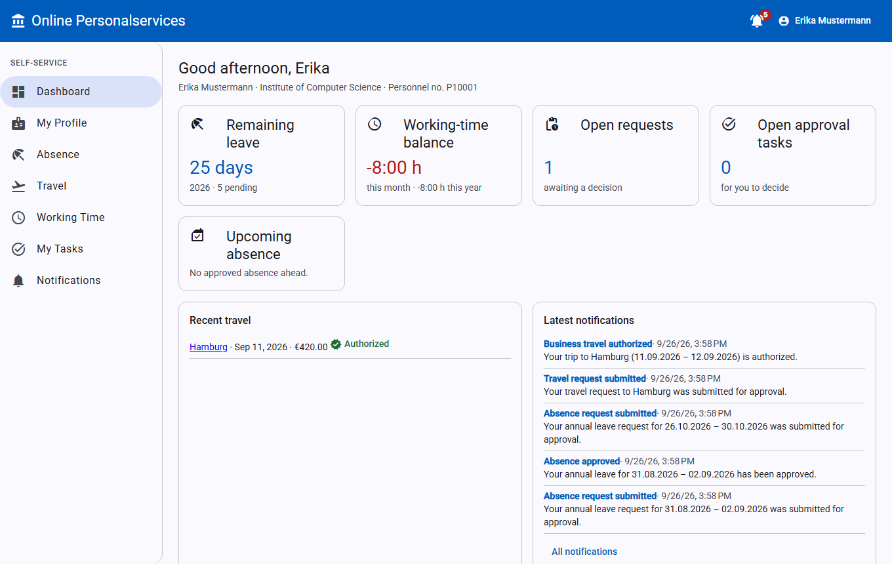
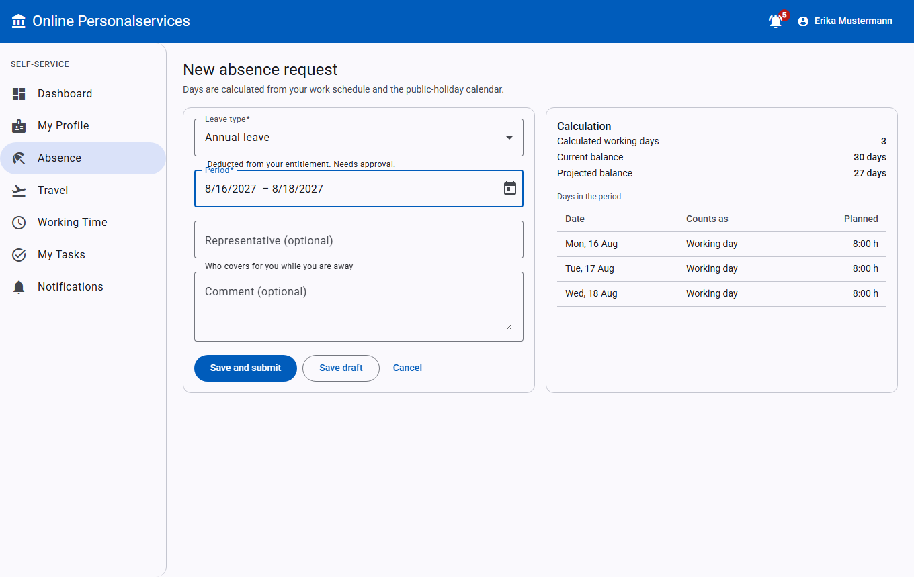
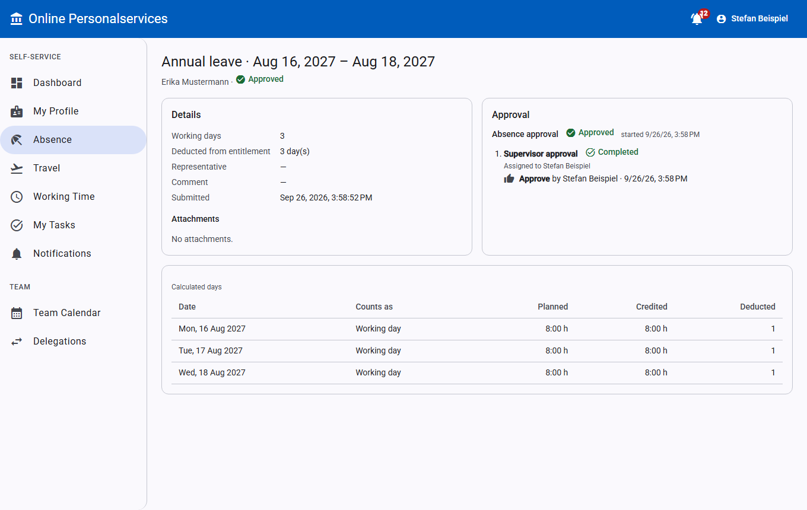
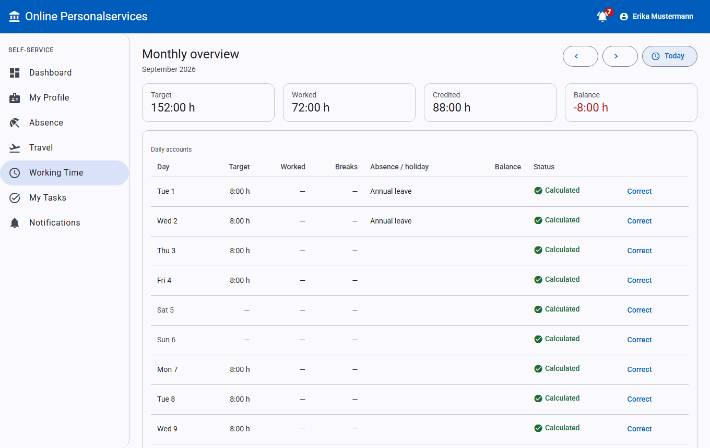
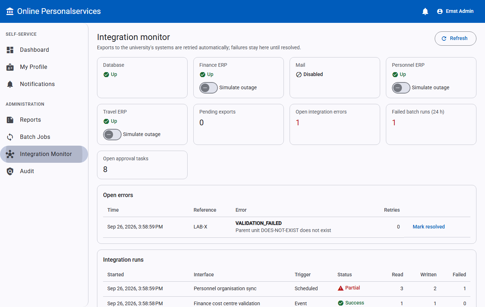

# Online Personalservices

[](https://github.com/majeedar/online-personalservices-ERP/actions/workflows/ci.yml)

A prototype employee self-service platform for a university administration:

- **Abwesenheitsverwaltung:** leave and absence;
- **Dienstreisemanagement:** business travel, expenses and settlement;
- **Zeiterfassung:** working time.

It covers shared workflow, delegation, notifications, audit, batch processing and integration with (mocked) ERP systems of record.

This prototype does not represent the implementation of any real university. All people, units, cost centres and systems in it are fictitious.

- Specification: [AGENT.md](AGENT.md)
- Architecture and decisions: [docs/architecture.md](docs/architecture.md)
- Further documentation:
  - [data model](docs/data-model.md)
  - [API](docs/api.md)
  - [workflows](docs/workflows.md)
  - [security](docs/security.md)
  - [integrations](docs/integrations.md)
  - [batch processing](docs/batch-processing.md)
  - [test strategy](docs/test-strategy.md)
  - [demo script](docs/demo-script.md)



## Architecture in brief

- **Backend:** a modular monolith (Spring Boot 3.5, Java 21) with ports and adapters inside each module. Module boundaries are verified by Spring Modulith and ArchUnit tests.
- **Data:** PostgreSQL, with the schema owned by Flyway.
- **Consistency:** a generic workflow engine drives all approvals. Decisions and request status commit atomically, and after-commit effects use a transactional outbox:
  - time credit for approved absences;
  - mail;
  - exports to the travel ERP and finance.
- **External systems:** personnel, finance and travel ERP are mocked by the separate `mock-erp` service.
- **Frontend:** the Angular 21 SPA is served by nginx, which also proxies the API, so the app runs on one origin with a session cookie and CSRF protection.
- **Languages:** English and German. The menu in the toolbar (and on the login page) switches without a reload; the choice is kept in the browser, and the default follows the browser language.

```text
Browser ─► nginx (Angular SPA, /api proxy) ─► backend (Spring Boot) ─► PostgreSQL
                                                  ├─► mock-erp (personnel · finance · travel ERP)
                                                  └─► MailHog (SMTP)
```

## Status

All phases of [AGENT.md §73](AGENT.md) are implemented:

| Phase | Scope |
|---|---|
| 1 Foundation | Repository, Docker, PostgreSQL + Flyway, demo login (mock SSO), error handling, correlation IDs |
| 2 Master data | Employees, employments, organisation, roles, approval relations, work schedules, seed data |
| 3 Absence | Leave types, entitlement ledger, work-schedule-aware day calculation, workflow, delegation, notifications, cancellation, attachments, team calendar |
| 4 Time | Clock in/out and breaks, daily accounts (statutory breaks, absence credit), monthly overview, corrections with approval, monthly closing |
| 5 Travel | Requests, split funding, supervisor + financial approval, expenses with receipts, travel-office review, settlement |
| 6 Integration | Ports + stub/HTTP adapters, mock-erp, mapping and validation, cost-centre check, travel export, finance posting, outbox, idempotency |
| 7 Batch & operations | 10 scheduled jobs, data retention, batch/integration history, retries, alerts, admin UI, system health, metrics, reports with CSV |
| 8 Quality | Architecture, unit, integration, frontend and end-to-end tests; documentation; demo script |

## Prerequisites

- **Full stack:** Docker with Docker Compose.
- **Development without Docker:** JDK 21, Maven 3.9+, Node.js ≥ 20.19 (22 LTS or 24 recommended).

## Start

### Everything with Docker

```bash
docker compose up --build
# optional monitoring (Prometheus :9090, Grafana :3000):
docker compose --profile monitoring up --build
```

| URL | What |
|---|---|
| http://localhost:4200 | Application |
| http://localhost:4200/swagger-ui.html | OpenAPI / Swagger UI |
| http://localhost:8025 | MailHog (outgoing mail) |

### Without Docker (development)

```bash
# Terminal 1 — backend on :8080 with an embedded PostgreSQL, demo data, in-memory ERP stubs
cd backend
mvn spring-boot:test-run -Dspring-boot.run.main-class=edu.university.ops.LocalDevApplication

# Terminal 2 — frontend on :4200, proxies /api to :8080
cd frontend
npm install
npm start
```

To use the real HTTP integration locally:
- start `cd mock-erp && mvn spring-boot:run` (port 8090);
- start the backend with `OPS_INTEGRATION_MODE=http MOCK_ERP_URL=http://localhost:8090`.

The embedded database is discarded when the backend stops.

## Demo accounts

All accounts use the password **`demo123`** (the login page has one-click buttons).

| Username | Person | Roles | Use in the demo |
|---|---|---|---|
| `employee` | Erika Mustermann | Employee | Leave, travel, time; has a missing clock-out and a past trip to settle |
| `parttime` | Paula Teilzeit | Employee | Mon–Thu schedule (Scenario 2); pending time correction |
| `supervisor` | Stefan Beispiel | Employee, Supervisor | Approves academic staff; team calendar; delegations |
| `supervisor2` | Bettina Leitung | Employee, Supervisor | Approves central administration; delegate of `supervisor` |
| `finance` | Frieda Finanz | Employee, Financial approver | Financial approval of trips |
| `travel` | Tim Reise | Employee, Travel office | Reviews and settles expense claims |
| `timeadmin` | Tanja Zeit | Employee, Time admin | Approves time corrections; working-time report; month closing |
| `hradmin` | Hanna Personal | Employee, HR admin | Sees all employees; leave and HR reports |
| `erpadmin` | Ernst Admin | ERP admin | Batch jobs, integration monitor, audit, outage simulation — no personnel data |
| `auditor` | Anton Pruefer | Auditor | Read-only audit and operations views |
| `nhalbtag` | Nina Halbtag | Employee | 50 % part-time, Mon–Fri 4 h |

## Demo scenarios

See [docs/demo-script.md](docs/demo-script.md) for the full 10–15 minute walkthrough. It covers:

- annual leave with approval;
- part-time day calculation;
- travel approval with ERP export;
- expense settlement with finance posting;
- time recording;
- time correction;
- integration failure and retry;
- batch synchronisation.

| | |
|---|---|
|  |  |
|  |  |

## Tests

```bash
cd backend && mvn test                         # 85 tests: architecture, unit, integration on real PostgreSQL
                                              # (-Dops.test.embedded-postgres=true skips Docker)
cd mock-erp && mvn test                        # 3 tests
cd frontend && npm test -- --watch=false       # 34 Vitest unit/component tests
cd frontend && npm run i18n:check           # every UI text goes through tr and has a German translation
cd frontend && npx playwright install chromium && npx playwright test   # demo scenarios + translation sweep (needs a running stack)
```

- Backend integration tests use Testcontainers when Docker is running, and an embedded PostgreSQL otherwise (ADR-012).
- CI ([.github/workflows/ci.yml](.github/workflows/ci.yml)) runs all suites on every push and pull request. The end-to-end job builds and starts the complete Docker Compose stack, runs Playwright against it, and uploads the screenshots; on failure it uploads the container logs.
- The Playwright suite targets http://localhost:4200 by default (`E2E_BASE_URL` to override) and refreshes the screenshots in `docs/screenshots`.

## Configuration

Settings are externalised in [application.yml](backend/src/main/resources/application.yml) and environment variables (AGENT.md §48). They cover:

- timezone and holiday region;
- task due and reminder days;
- statutory breaks;
- travel currencies, financial-approval threshold and receipt rules;
- integration mode, URLs, timeouts, retries and outbox attempts;
- batch schedules;
- mail.

Secrets come from the environment ([.env.example](.env.example)); none are committed.

## Known limitations (prototype)

- External ERP systems are mocked (`mock-erp`), and SSO is simulated by a mock identity provider.
- Payroll is out of scope. Travel reimbursement is simplified: the sum of receipts, with no per-diem or statutory rules, and expenses must be in the trip currency.
- Document storage is a mounted folder with metadata in the database; there is no virus scanning.
- University-specific HR policies are configurable placeholders:
  - 30 leave days, pro rata by working days per week;
  - 10 days carry-over expiring 31 March, with the expiry informational until the yearly job runs;
  - statutory breaks as in German law.
- Roles are resolved at login, so a role change applies at the next login.
- Server texts follow the chosen language too (notifications, tasks, errors, reports, e-mails in the employee's saved language). Two kinds of text stay as they are: messages from the external ERP systems in the integration monitor, and names entered as data (organisation units, funding sources, custom leave types). Technical batch-error details are English.
- Optional enhancements (AGENT.md §93), such as a BPMN engine, Keycloak, MinIO and WebSockets, are not implemented.
