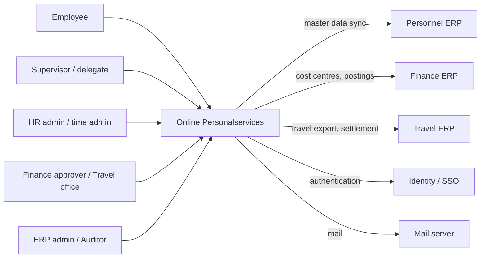
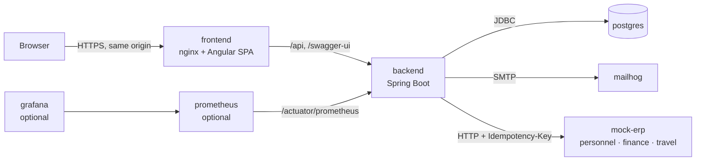
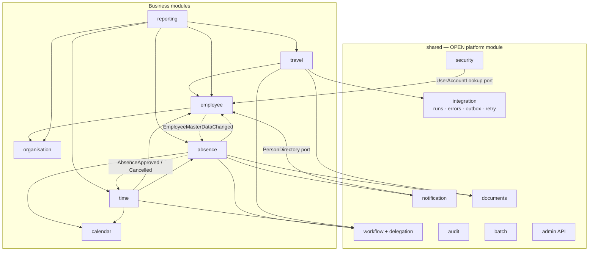
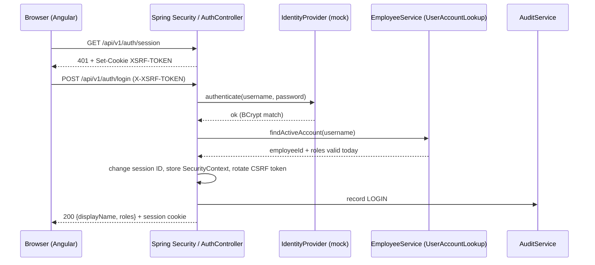
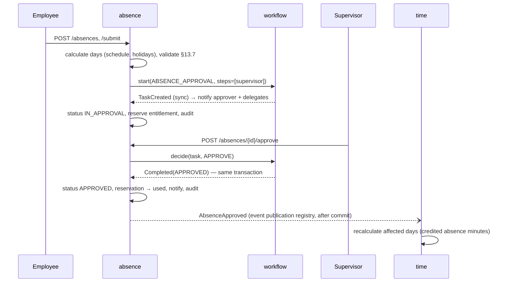
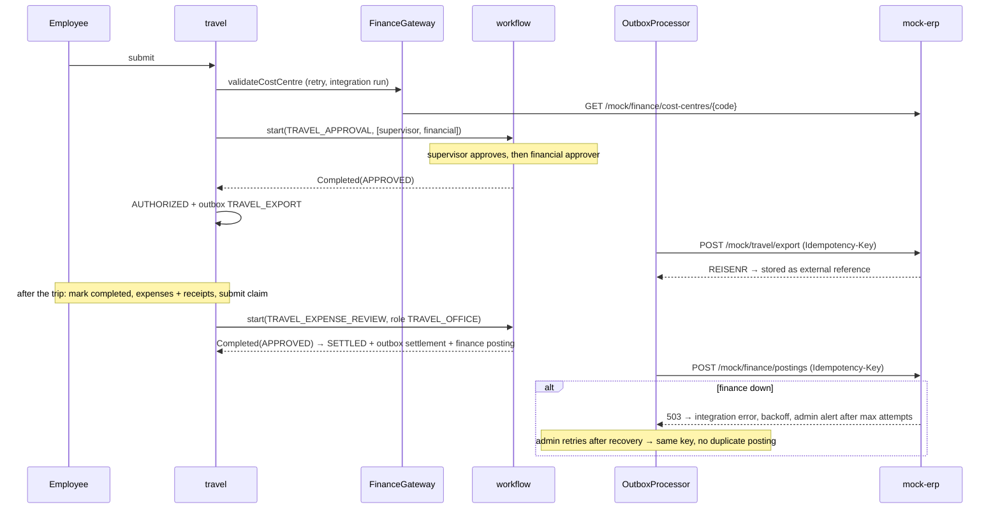
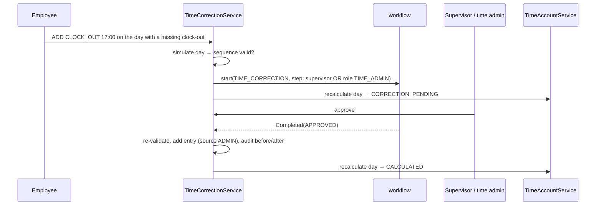
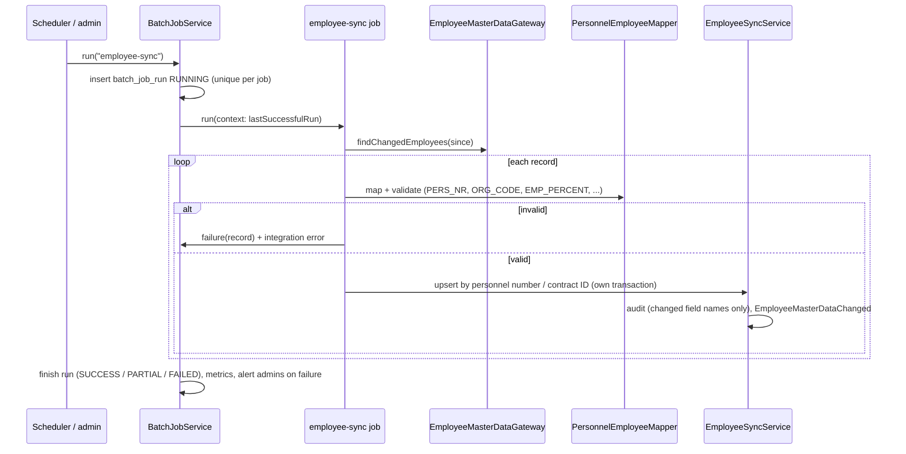

# Architecture — Online Personalservices

This document describes the architecture of the prototype and records the architecture decisions (ADRs) that refine [AGENT.md](../AGENT.md). Where an ADR is more specific than AGENT.md, the ADR wins.

> Status: all phases (1–8) are implemented. Related documents: [data model](data-model.md) · [API](api.md) · [workflows](workflows.md) · [security](security.md) · [integrations](integrations.md) · [batch processing](batch-processing.md) · [test strategy](test-strategy.md) · [demo script](demo-script.md).

## 1. Overview

Online Personalservices is a **modular monolith** with a **hexagonal (ports and adapters)** structure inside each module. It is a self-service portal, workflow platform and integration layer in front of the university's existing systems of record: the personnel ERP, the finance ERP, the travel ERP and identity management. It does not replace those systems.

| Concern | Choice |
|---|---|
| Backend | Java 21, Spring Boot 3.5, Spring Modulith 1.4, Spring Security, Spring Data JPA, Micrometer |
| Database | PostgreSQL 17, schema owned by Flyway (`ddl-auto=validate`) |
| Frontend | Angular 21 (standalone components, signals), Angular Material |
| External systems | `mock-erp`: a separate Spring Boot service with personnel, finance and travel ERP mocks |
| Runtime | Docker Compose: `postgres`, `backend`, `frontend` (nginx), `mock-erp`, `mailhog`; optional `prometheus` + `grafana` |
| Tests | JUnit 5, Spring Modulith / ArchUnit, MockMvc on real PostgreSQL, Vitest, Playwright |

**Frontend version (AGENT.md §4.2):** Angular 21 is used, not 22. The Angular 22 CLI requires Node ≥ 24.15, and the development machine had 24.13. Angular 21 is an LTS release and satisfies "Angular 18+"; upgrading later is `ng update`.

## 2. System context



## 3. Container view



The browser only ever talks to nginx. nginx serves the SPA and reverse-proxies the API, so the API is same-origin: no CORS configuration exists, and cookies stay `SameSite=Lax` (ADR-005). Actuator endpoints are not proxied.

## 4. Component view (backend modules)



Each business module has this internal layout:

```text
edu.university.ops.<module>
├── <Facade>.java        public API for other modules (EmployeeDirectory, AbsenceLookup, TravelReports, ...)
├── <Module>Events.java  public domain events
├── domain/              entities, value objects, pure rules, ports (repository/gateway interfaces)
├── application/         use cases, transactions, authorization policies, batch jobs
├── api/                 REST controllers + request/response DTOs
├── persistence/         Spring Data adapters implementing domain ports
├── integration/         adapters to external systems (stub + HTTP)
└── demo/                demo-data seeders (profile "demo" only)
```

Dependencies point inward: `api → application → domain ← persistence / integration`. Both the module structure and these rules are verified by [ArchitectureTest](../backend/src/test/java/edu/university/ops/ArchitectureTest.java).

## 5. Architecture Decision Records

### ADR-001 Modular monolith, verified by Spring Modulith
**Decision:** One deployable unit. Each top-level package under `edu.university.ops` is an application module. `ApplicationModules.verify()` runs as a unit test and fails the build on cycles or on access to another module's internals.
**Why:** The modules share many concepts, the load is moderate, and a small team must be able to operate it. Modules can be extracted later along the verified boundaries.

### ADR-002 Hexagonal dependency direction
**Decision:** The domain defines ports and adapters implement them. The domain never imports `api`, `application`, `persistence` or `integration` (enforced by ArchUnit).
**Pragmatic trade-off:** Domain entities carry JPA annotations. Separate persistence models would double the code for little gain in a prototype. Repository ports are plain interfaces, and Spring Data implements them via `JpaXRepository extends Repository<…>, XRepository`. The domain never sees `JpaRepository` and its generic methods.

### ADR-003 Cross-module references by ID only
**Decision:** Entities never hold JPA associations to entities of another module. For example, `Employee.organisationUnitId` is a `UUID`. Other modules read data through the owning module's facade, which returns read-only records. Foreign keys still exist in the database, because referential integrity is a database concern.

### ADR-004 Ownership of workflow state
**Decision:** The business module owns the request status. The workflow engine owns only step, decision and task state. The engine publishes `WorkflowEvents.Completed` and `TaskCreated` **synchronously**, inside the deciding transaction, so the business status and the decision commit together. The engine never calls business modules. `UserTask` is the inbox projection of an active step.

### ADR-005 Session cookie + CSRF, same origin
**Decision:** Login is `POST /api/v1/auth/login`. The server creates an HTTP session and rotates the session ID and the CSRF token on login. CSRF uses the cookie repository: the `XSRF-TOKEN` cookie is echoed in the `X-XSRF-TOKEN` header, which Angular does automatically. nginx serves the SPA and the API from one origin. Roles are resolved on the server at login and are never read from the client.

### ADR-006 Transactional outbox is required
**Decision:** There are two mechanisms, with one principle: nothing that must happen after a commit may be lost.
- **Cross-module events** (e.g. `AbsenceApproved` → time module, `NotificationCreated` → mail) go through the Spring Modulith **event publication registry** (`event_publication`). Listeners are `@ApplicationModuleListener`s; incomplete publications are re-delivered on restart.
- **External exports** (travel ERP export, settlement, finance posting) go through an explicit **`outbox_event` table**, delivered by `OutboxProcessor` under a row lock (`FOR UPDATE SKIP LOCKED`). Each event carries an idempotency key that is forwarded to the external system, so a retry never creates a second posting (AGENT.md §29).

### ADR-007 Mock ERPs run in their own container
**Decision:** The `/mock/*` endpoints of AGENT.md §23 run as the separate `mock-erp` service ([mock-erp/](../mock-erp)). Stopping the container, or switching a system to "down" from the Integration Monitor, is a realistic outage (Demo Scenario 7).

### ADR-008 Audit log is append-only in the database
**Decision:** A trigger on `audit_log` rejects `UPDATE`, `DELETE` and `TRUNCATE` for every database user. `AuditLogRepository` exposes only `save` and read methods (enforced by ArchUnit). `AuditService` joins the caller's transaction, so an audit row exists if and only if the audited change was committed.

### ADR-009 Demo data is separate from migrations
**Decision:** Schema and reference data (roles, leave types, workflow definitions) are in `db/migration`. Fictitious master data is in `db/seed`, as repeatable and idempotent scripts that only the `demo` profile loads. Requests, bookings and trips are created at startup by `*DemoData` runners **through the real application services**, relative to today. Seeded data therefore always satisfies the business rules and looks current.

### ADR-010 Time handling
**Decision:** System timestamps are `Instant` (`timestamptz`, JDBC time zone UTC). Pure dates are `LocalDate`. The business date of a clock event is derived in `ops.timezone`, except that an event continuing a shift from the previous day stays on that day (night shifts). All code obtains time from the injected `Clock`.

### ADR-011 No DELEGATE role
**Decision:** Delegation is a time-bounded relation per approval type. It is resolved when tasks are queried: tasks stay assigned to the delegator and are visible to active delegates. `ApprovalDecision.onBehalfOfId` records the delegator.

### ADR-012 Integration tests on real PostgreSQL
**Decision:** [PostgresTestSupport](../backend/src/test/java/edu/university/ops/support/PostgresTestSupport.java) uses Testcontainers when a Docker daemon is reachable, and falls back to an embedded PostgreSQL binary otherwise. H2 is never used. The same fallback powers `LocalDevApplication` (`mvn spring-boot:test-run`).

### ADR-013 Reporting is a module, not `shared/reporting`
**Decision:** AGENT.md §5 places reporting under `shared/`. Reports, however, read from absence, travel, time, employee and organisation, and `shared` must not depend on business modules (ADR-001). Reporting is therefore the top-level module `reporting`, which uses only the modules' public read APIs (`AbsenceReports`, `TravelReports`, `TimeAccounts`).

### ADR-014 A time account starts with the first booking
**Decision:** Days before an employee's first time entry show their target but do not count towards the balance (opening balance 0). Without this, introducing time recording mid-year would show a deficit for every earlier working day.

### ADR-015 Two integration modes
**Decision:** Every port has an in-memory **stub** adapter and an **HTTP** adapter to `mock-erp`, selected by `ops.integration.mode`. Stub mode keeps tests and local development free of external processes, and supports the same simulated outages. Docker Compose runs HTTP mode. Adapters live in the module that owns the port. `shared/integration` holds only cross-cutting infrastructure: runs, errors, retry, outbox, HTTP client, correlation propagation.

### ADR-016 Monthly closing freezes time accounts
**Decision:** Closing a month recalculates and then freezes every day of it (`time_account_day.status = CLOSED`). The stored values become authoritative, and corrections and backdated bookings are rejected until the month is reopened (with a reason, audited). Absence changes that touch a closed month are not applied automatically; time admins are notified instead.
**Why:** Payroll and reporting need stable monthly figures. A derived-only model (ADR-014) would silently change closed figures whenever an input changed.

### ADR-017 Data retention anonymises, it does not delete
**Decision:** The `data-retention` job (`shared/retention`) runs one `RetentionTask` per module (absence, travel, time corrections, notifications). A task clears personal free text, representatives, decision comments and attachments of finished requests older than the configured period, and sets `anonymised_at`. Rows, status, dates and amounts stay.
**Why:** Entitlements, time accounts, reports and ERP exports reference these rows. Deleting them would change historical balances and break reconciliation. Personal detail beyond what these need is what data protection asks us to remove. Keeping the tasks inside the modules means `shared` does not depend on business modules (ADR-001).

### ADR-018 Half days are day parts of the first and last day
**Decision:** A request has a `startDayPart` and an `endDayPart` (`FULL`, `MORNING`, `AFTERNOON`). A single day is a full day, a morning or an afternoon. A longer absence may start at noon and end at noon, and every day in between is a full day. A half working day deducts 0.5 days and plans and credits half the day's target. Two requests may share a date only if one covers the morning and the other the afternoon. The time module adds up the minutes of both.
**Why:** This covers what people actually request (a half day off, leaving at noon before a trip) without hourly leave. Hourly leave would need a different entitlement unit and times of day in the time account.

### ADR-019 German/English interface with a runtime switch
**Decision:** The SPA translates at runtime. `core/i18n` holds the language as a signal, `tr()` and the impure `tr` pipe, and `ldate` / `lcurrency` pipes that format in the current locale. English source texts are the keys, and German lives in `de.json`. A missing entry falls back to English, and `npm run i18n:check` (run in CI) fails if any text passed to `tr` has no German entry. Enum codes are shown via `humanize()`, which uses `enum.<CODE>` entries. Known error codes use `error.<CODE>` entries; otherwise the server message is shown as sent. The choice is stored in `localStorage`, and the default follows the browser language.
**Why:** Angular's built-in i18n compiles one bundle per locale, so switching needs a reload and a separate URL per language, and the build doubles. English keys keep templates readable and make a missing translation harmless. Server-generated texts (notifications, task titles) stay English. Translating them would need the recipient's language in the backend, which the prototype does not store.

## 6. Security model (summary — details in [security.md](security.md))

| Layer | Mechanism |
|---|---|
| Authentication | `IdentityProvider` port (mock SSO, BCrypt) → `UserAccountLookup` port (active employee + currently valid roles) |
| URL rules | `/api/v1/admin/**` → ERP_ADMIN, SUPPORT, AUDITOR (writes need ERP_ADMIN / SUPPORT); reports have a per-report role list |
| Object level | Policy per module: owner, current approver (approval relation), active delegate / workflow participant, specific roles (HR_ADMIN, TRAVEL_OFFICE, TIME_ADMIN) |
| Errors | One JSON shape `{code, message, correlationId, details}`, also for 401/403 from the filter chain; no stack traces |
| Correlation | `X-Correlation-Id` accepted if safe, else generated; stored in the MDC, ECS JSON logs, audit rows, integration and batch runs; forwarded to mock-erp |

## 7. Sequences

### Login



### Absence approval (Demo Scenario 1)



### Travel approval and settlement (Demo Scenarios 3, 4, 7)



### Time correction (Demo Scenario 6)



### Employee synchronisation (AGENT.md §27.1)


