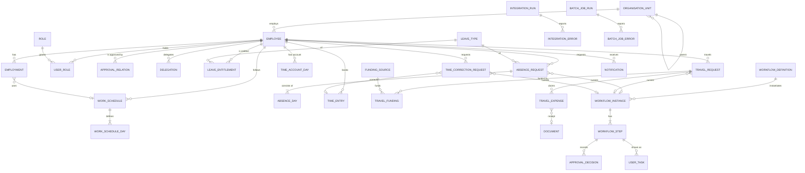

# Data model

PostgreSQL 17. The schema is created by Flyway migrations in [backend/src/main/resources/db/migration](../backend/src/main/resources/db/migration); Hibernate only validates it.

| Migration | Content |
|---|---|
| `V1__master_data.sql` | organisation, employees, employments, work schedules, roles, approval relations, holidays, audit log (+ append-only trigger), Modulith event publication |
| `V2__workflow_notification_absence.sql` | workflow engine, delegation, notifications, leave types, entitlements, absence requests and days, documents |
| `V3__time.sql` | time entries, daily time accounts, time corrections |
| `V4__travel_integration_batch.sql` | funding sources, travel requests, fundings, expenses, integration runs/errors, outbox, batch runs/errors |
| `V5__time_month_closing.sql` | monthly closing of time accounts (one active closing per month, history kept) |

Demo data is loaded only by the `demo` profile (`db/seed/R__*.sql`, repeatable and idempotent), see ADR-009.

## Conventions (AGENT.md §77, §78)

- Internal IDs are UUIDs; external identifiers (`external_employee_id`, `external_employment_id`, `external_id`, `personnel_number`, `idempotency_key`) have unique constraints.
- System timestamps are `timestamptz` (UTC); business dates are `date`.
- Enumerations are `varchar` with `CHECK` constraints (readable in SQL, safe against typos).
- Optimistic locking (`version`) on aggregates that users change concurrently: employee, employment, organisation unit, absence request, leave entitlement, workflow instance, user task, travel request, time account day, time correction.
- Master data is deactivated, never deleted; entries are voided, never deleted; audit rows cannot be changed (trigger).
- Modules reference each other's rows by ID only (ADR-003); foreign keys still enforce integrity.
- Derived values are not stored when they can drift: `leave_entitlement.remaining_days` is computed.

## Entity relationships

`document`, `workflow_instance`, `notification` and `audit_log` refer to business objects generically by `(business_object_type, business_object_id)`; `outbox_event` by `(aggregate_type, aggregate_id)`.

## Tables by module

| Module | Tables |
|---|---|
| organisation | `organisation_unit` |
| employee | `employee`, `employment`, `work_schedule`, `work_schedule_day`, `role`, `user_role`, `approval_relation` |
| calendar | `holiday` |
| absence | `leave_type`, `leave_entitlement`, `absence_request`, `absence_day` |
| time | `time_entry`, `time_account_day`, `time_correction_request`, `time_month_closing` |
| travel | `funding_source`, `travel_request`, `travel_funding`, `travel_expense` |
| shared/workflow | `workflow_definition`, `workflow_instance`, `workflow_step`, `approval_decision`, `user_task`, `delegation` |
| shared/notification | `notification` |
| shared/documents | `document` (metadata only; content in the document store) |
| shared/audit | `audit_log` |
| shared/integration | `integration_run`, `integration_error`, `outbox_event` |
| shared/batch | `batch_job_run` (unique partial index: one RUNNING row per job), `batch_job_error` |
| Spring Modulith | `event_publication` |

## Notable modelling decisions

- **`absence_day`** stores every calendar day of a request with its `day_kind` (working day, non-working day, holiday, no schedule), planned and credited minutes and entitlement deduction. Only working days reduce the entitlement (AGENT.md §13.6).
- **`leave_entitlement`** is a ledger: `reserved_days` for pending requests, `used_days` for approved ones. The yearly job recomputes both from `absence_day` and must find no difference.
- **`time_entry.business_date`** is stored explicitly (see ADR-010) and `voided_at` / `correction_request_id` keep the correction history.
- **`workflow_step`** carries its task title and description so later steps can be activated without the business module (ADR-004).
- **`approval_decision.on_behalf_of_id`** records delegation (ADR-011).
- **`outbox_event.idempotency_key`** is unique: enqueueing twice is a no-op, and the key is sent to the external system.
