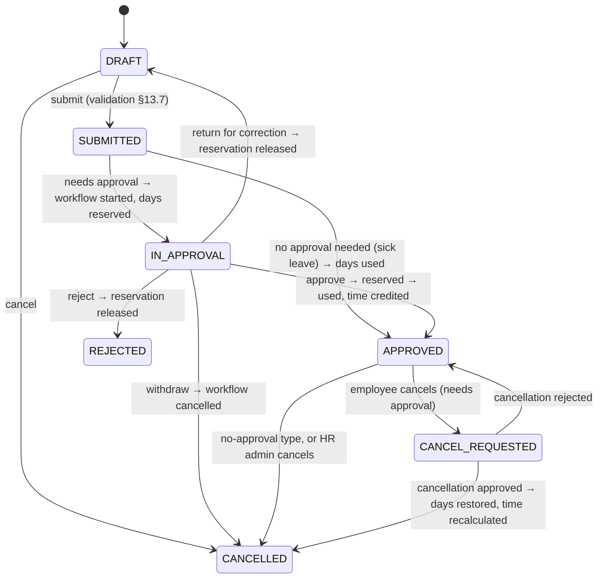
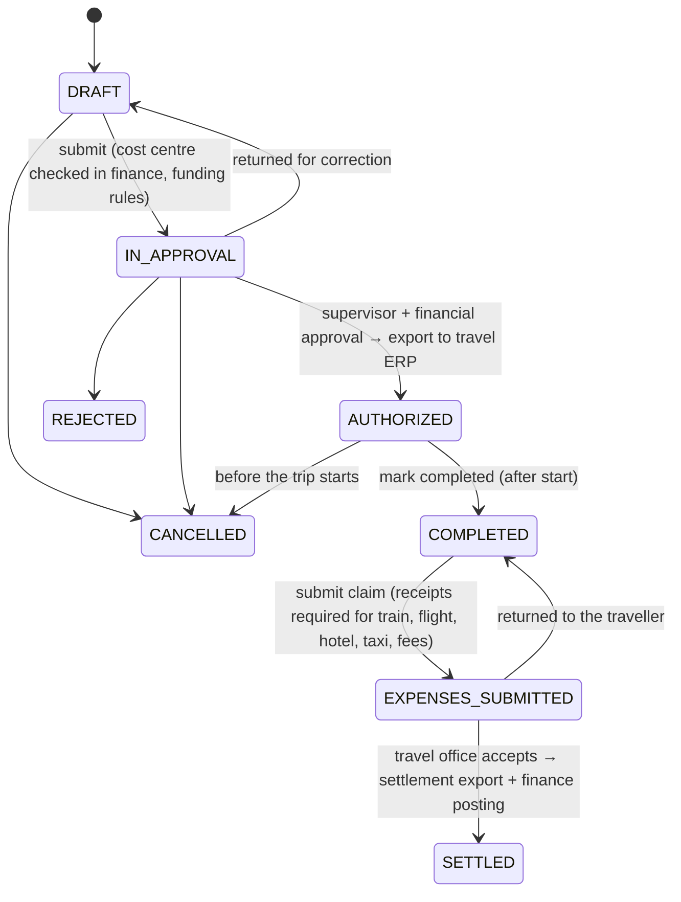
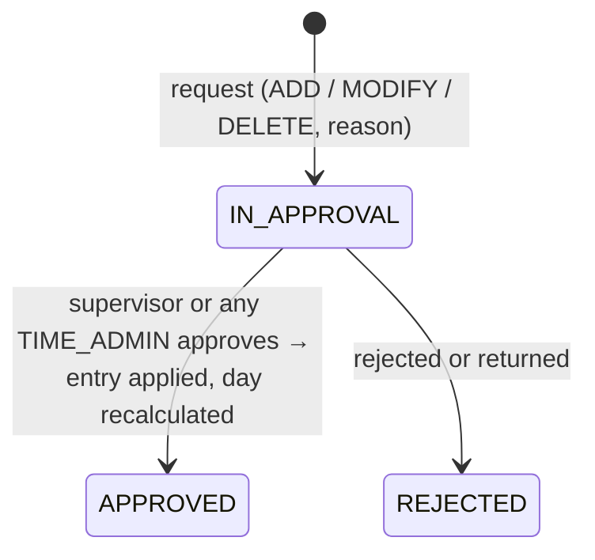
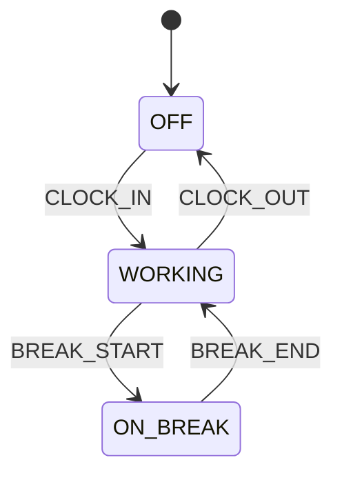

# Workflows

## Workflow engine (AGENT.md §16–18)

A small, generic engine in `shared/workflow`. It is not a BPMN engine.

- **Definitions** (`workflow_definition`): `ABSENCE_APPROVAL`, `ABSENCE_CANCELLATION`, `TRAVEL_APPROVAL`, `TRAVEL_EXPENSE_REVIEW`, `TIME_CORRECTION`.
- **Start:** the business module resolves the approvers (it knows the approval relations) and starts an instance with an ordered list of `StepSpec`s. Each step is assigned to a person, to a role, or to both (for example the supervisor *or* any `TIME_ADMIN`).
- **Execution:** steps run sequentially. The active step has one open `UserTask` in the inbox. Decisions are `APPROVE` (next step or finish), `REJECT`, `RETURN_FOR_CORRECTION`, or `FORWARD` (reassign to a person).
- **Outcome:** the engine publishes `WorkflowEvents.Completed(APPROVED | REJECTED | RETURNED)` **synchronously**. The owning module changes its request status in the same transaction (ADR-004).
- **Rules enforced by the engine:**
  - nobody decides on their own request;
  - only the assignee, a holder of the assigned role, or an **active delegate** of the assignee may decide;
  - reject and return need a reason;
  - a completed task cannot be decided again (status check plus optimistic lock: a second, concurrent approval gets `409 INVALID_WORKFLOW_STATE` / `CONCURRENT_MODIFICATION`).
- **Delegation:** `delegation(delegator, delegate, approvalType, validFrom, validTo)`. It is resolved when tasks are queried, so no task is copied or reassigned. The decision records `on_behalf_of_id`. Task notifications go to the assignee and to active delegates.
- **Reminders:** the `workflow-reminder` job notifies approvers of tasks older than `ops.workflow.reminder-after-days`, at most once per task, person and day.

## Absence request (AGENT.md §13)

The transitions live in one place, `AbsenceStatus`. Anything else is `409 INVALID_WORKFLOW_STATE`.

**Validation on submission** (all rules are evaluated; the preview shows every issue at once):
- end date not before start date, at most one year;
- the leave type is active;
- the employee is active;
- an employment covers the whole period;
- no overlap with a submitted, pending, approved or cancel-requested absence;
- enough balance per calendar year (deducting types only);
- the representative is not the employee and is active;
- the period contains at least one working day;
- an attachment exists where the type requires one.

**Day calculation:** for each day, the schedule valid on that day and the holiday calendar decide whether it is a working day, a non-working day or a holiday. Only working days carry planned minutes, credited minutes (if the type credits working time) and one day of deduction (if the type deducts entitlement).

| Leave type | Deducts | Approval | Credits time |
|---|---|---|---|
| Annual leave | yes | yes | yes |
| Flex day | no | yes | no (uses overtime) |
| Sick leave | no | no | yes |
| Special leave | no | yes | yes |
| Unpaid leave | no | yes | no |

## Travel request (AGENT.md §14)

The financial approval step is added when the estimated cost exceeds `ops.travel.financial-approval-threshold` (default 0, so it is always added). Split funding must use either percentages totalling 100 or amounts not exceeding the estimate.

## Time correction (AGENT.md §15.5)

A correction is accepted only if the day's resulting sequence is valid (clock in → [break start → break end]* → clock out, with strictly increasing times). The check runs again at approval, because the day may have changed in the meantime. Entries are never deleted: `MODIFY` and `DELETE` void the original entry, and `ADD` / `MODIFY` add an entry with source `ADMIN`. While a correction is pending, the day shows `CORRECTION_PENDING`.

## Time clock

The daily account is: `credited = worked + credited absence`, `balance = credited − target`.
- Recorded breaks are not working time.
- The statutory minimum break is enforced: more than 6 hours of work need 30 minutes, more than 9 hours need 45 minutes. A shortfall is deducted (`ops.time.statutory-breaks`).
- Holidays have target 0.
- Days before the first booking do not count (ADR-014).
